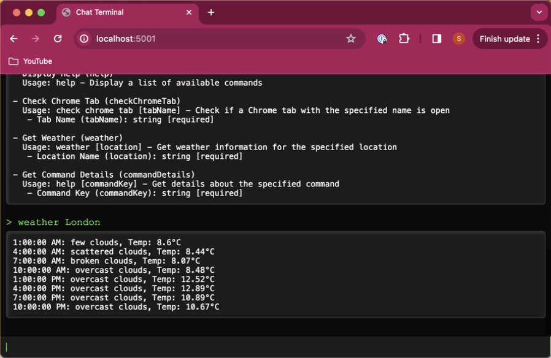

# Chatblox

## Links

* [README page on github](https://github.com/storizzi/chatblox/README.md)
* [License Details](./LICENSE.md)
* [Command Summary](./doc/LLM_SUMMARY_commands.md) - LLM Generated
* [Release Notes](./release/RELEASE.md)
* [Roadmap](./doc/ROADMAP.md)

## Introduction

Chatblox is an early work-in-progress, with the aim of producing something like a chat experience in the browser to access a variety of tooling that helps me get things done in a more formalized plug-in kind of a way, but being able to use a mixed variety of scripts and tools to help me.

This is in an effort to try to bring back a lot of the productivity tools I use to my computer, so I am less reliant on external services, and so I know I have a copy of the data I own in one place (on my computer) rather than floating around a hundred different cloud locations. And to automate a lot of the tasks (many of which would benefit from joining up some of these dispirate sources of information) once I've got enough together to be useful.

## Intentions for project

I'm starting basic, but over time I'm aiming to bring in other projects I'm working on such as:

* Managing working projects on my computer (mostly git-based)
* Managing documentation on my computer (in various forms - some of it held on the cloud by default - e.g. in Apple Notes and Evernote). See my project for export Apple Notes - that'll probably be one of the first things I'll bring in.
* Generating documentation from various data in various formats - e.g. blog post, social media post, book (e.g. PDF / Kindle book), web page etc. - see my Storizzi project for an example of how dispirate data sources can be brought together to generate documentation.
* Managing my Kanbans / To-Dos / Journal - I have a Trello-based working version of a system of working which aims to focus everything onto just a couple of lists (one for stuff to do today and the other for stuff destined for an automated daily journal), but looking to include another version I'm working on, perhaps as an embedded component - no reason all of the output has to be text-based. That's early stages too, but I've got it working on web and as an iOS app so far albeit with no authentication yet!!!
* Plugin architecture to bring in external tools - installing them, uninstalling them etc
* LLM integration - initially very basic local LLM integration most likely using Ollama (as I'm finding that really easy to use), simple ChatGPT integration, and Langchain integration - with a view to utilising the various other locally stored knowledge as extended memory - e.g. using something like MemGPT or using local / online search tools. Also using plugins as tools that agents can be asked to use. Also some thought of building agents to help work on projects on my computer, or create their own projects based on guidelines. There are so many approaches to this right now, I'll be tinkering to start with, probably using tools like AutoGPT, LangGraph and CrewAI
* Long term goal is to build a bunch of tools I can use to help me in my day-to-day life, and work out ways over time to use these tools, so that I can hand this work off to agents
* So this will start looking a bit like other LLM agent solutions popping up everywhere, except I'm looking to work from a tools-first approach. Work out what tools you would want to use to do the job manually and use them from a chat style interface. Then start finding ways to automate everyday tasks that can be run by LLMs over time, so you are handing off more and more of the drudge stuff.
* One other area I've been working on is Email automation. I've got a basic PoC working which uses Thunderbird email client, and then leverages the fact that it uses standard mailbox files so you don't have all the configuration angst with things like gmail. This seems to work ok, but again - early days. I've just about got it to do a simple search through emails, but it needs a lot more work
* The current iteration is very much with a mac in mind, although it should work fine on Linux and WSL (for Windows) as well. I just haven't tested it yet. Feel free to do so and give feedback.
* I have yet another concept that I have never found a good way of implementing based on developing tooling based on the user's current overlap of contexts. I parked this some years ago, but I have a feeling that once we have this in place, it's going to become more helpful at joining up the LLM side of things, the tooling, and what data is relevant to expose (thus helping with the restricted context window you get with most LLMs). Not quite the 'working memory' model that MemGPT has, but possibly something that can better work out what data is relevant in different contexts.
* No idea of timescales right now. I have created a big heap of PoCs, and this is where I start gluing them together. So please be patient.

At the moment, the only people likely to be vaguely interested in this are those with some development skills in either python or node.js or maybe both. Feel free to play, and give me some feedback.

## Getting Started

You can use either the node or the python version of Chatblox - they are functionally equivalent, so it really depends on your preference.

* [Node version README](./node/README.md)
* [Python version README](./python/README.md)
* [Command Summary](./doc/LLM_SUMMARY_commands.md) - LLM Generated - shared by both version

In essence, both do the same thing - they execute external command in a structured way, and they share the same .env file structure (or environment variables that can be passed), and the same structure of commands.json which gives a list of available commands, with the commands inside the 'commands' folder and the settings files (like an .env file for each script) inside the script-settings folder.

The types of commands cover shell, node.js (and it auto-imports modules as necessary), and AppleScript. No, not even python even though there's a python version. Reason being, I started with Node and ported it over to python, because I'm not yet sure which code line I will be continuing with as both have pros and cons. So I'll continue developing them in parallel, and at some point, split them into their own repos or discontinue one of them.
